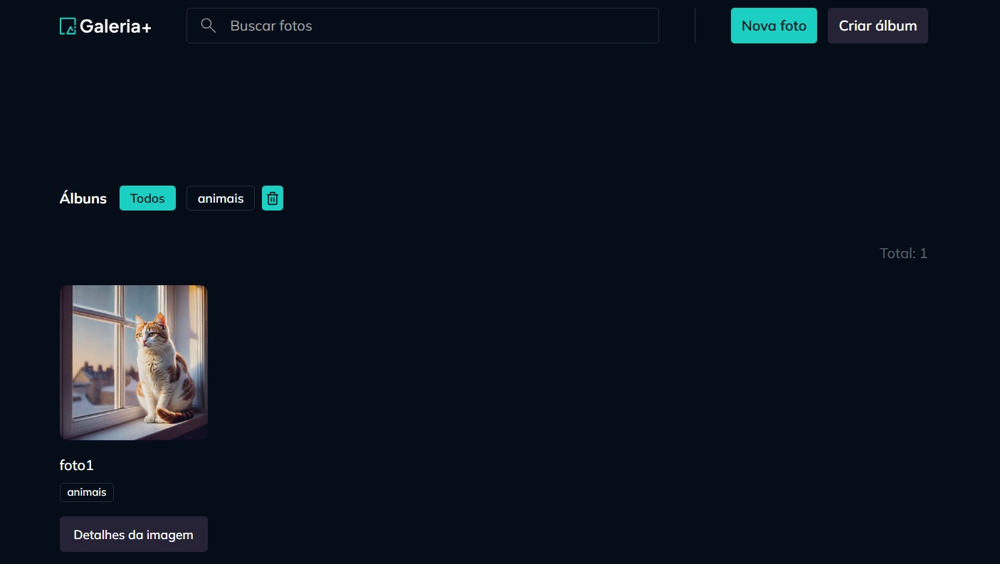

# Gallery Plus 🚀



Aplicação web desenvolvida durante o curso da Rocketseat para praticar **React**, integração com **API** e organização de projeto **Fullstack**.  
O projeto foi feito utilizando **TypeScript**, garantindo tipagem e melhor organização do código.

---

## Tecnologias

- **Linguagens:** TypeScript, JavaScript  
- **Frontend:** React, React Router DOM, Axios  
- **Backend:** Node.js, Express  
- **Validação de dados:** Zod  
- **Controle de rotas e navegação:** React Router DOM  
- **Ferramentas:** Git, VS Code, pnpm  

---

## Sobre o projeto 📸

O **Gallery Plus** permite gerenciar álbuns e fotos de forma simples. Conceitos praticados no projeto:

- Criação de rotas com **React Router DOM**  
- Consumo de API com **Axios**  
- Validação de dados com **Zod**  
- Organização de componentes em **TypeScript**  
- Uso de bibliotecas e ferramentas modernas como **Node.js**, **Express** e **Git**

> Esse projeto foi desenvolvido seguindo as práticas do curso da Rocketseat, com foco na implementação prática dos conceitos apresentados no curso.

---

## 🔗 Acesse o projeto
👉 Deploy: https://gallery-pluss.up.railway.app/

---

## Como rodar o projeto 🔧

### 📥 Clonar o repositório

```bash
git clone https://github.com/Andersondev123/gallery-plus.git
```
### Execute o comando de instalação
```bash
pnpm install
```
### Em seguida, em um terminal, execute o servidor de back-end
```bash
pnpm dev-server
```

### Em outro terminal, execute o servidor de front-end
```bash
pnpm dev
```

